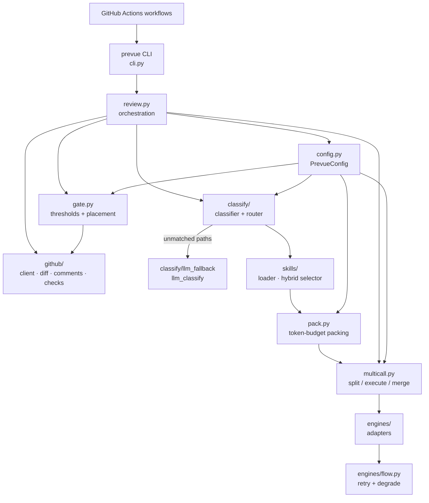

<!-- generated-by: gsd-doc-writer -->

# Architecture

## System overview

Prevue is a token-efficient AI pull-request review framework delivered as a GitHub Actions reusable workflow (`workflow_call`). On each eligible `pull_request` event, it fetches the PR diff via the GitHub REST API (no PR-head checkout), classifies the full changed-file set to determine relevant skill bundles, loads built-in and consumer skills from the trusted base ref, selects matching skills via a hybrid deterministic keyword floor plus optional LLM escalation, packs changed files into a per-call token budget, optionally splits the packed diff across multiple engine calls grouped by bundle and import co-location, merges and deduplicates findings across all calls, and posts results back to the PR as a sticky summary comment, batched inline review comments, and a `prevue/review` check run.

The architecture is a layered pipeline: **workflow shell → CLI → orchestration → classify-first → skills/pack → multi-call engine → merge/gate → GitHub publisher**. Python owns all review logic; the reusable workflow only sets up the runner, checks out the framework and the consumer base ref, installs dependencies and the engine CLI, and invokes `uv run prevue review`.

## Component diagram



ASCII equivalent:

```
.github/workflows/  →  prevue CLI (cli.py)  →  review.py
                                                  ├─ config.py (PrevueConfig from prevue.yml)
                                                  ├─ github/ (client, diff, comments, checks, graphql)
                                                  ├─ classify/ (classifier → router → llm_fallback)
                                                  ├─ skills/ (loader → select_skills_hybrid → assemble)
                                                  ├─ pack.py (priority rank, token budget, readmit)
                                                  ├─ multicall.py (split → execute → merge_findings)
                                                  ├─ engines/ (CopilotCli, ClaudeCode, Cursor, Gemini)
                                                  └─ gate.py (severity thresholds, conclusion, placement)
```

## Data flow

A typical same-repo PR review follows this path:

1. **Trigger** — `pull_request` (`opened`, `synchronize`, `reopened`, `ready_for_review`) fires `review.yml`. That workflow first polls `ci.yml` to completion, then calls the reusable workflow `prevue-review.yml`.
2. **Dual checkout** — `prevue-review.yml` checks out the Prevue framework at `.prevue/` and the consumer repo at the **base ref** (`consumer/`). Consumer config and skills always load from the trusted base ref, never from the PR head (SKIL-04 safeguard). `PREVUE_CONSUMER_ROOT` is set to `$GITHUB_WORKSPACE/consumer`.
3. **Preflight** — `prevue preflight` compares `PR_HEAD_SHA` to the last-reviewed SHA stored in the sticky comment marker. A same-SHA re-run skips engine CLI install.
4. **Engine CLI install** — `install-engine-cli.sh` dispatches to the appropriate vendor install (npm for Copilot, brew/pip for others) if preflight indicates a new SHA.
5. **Config load** — `prevue review` reads `GITHUB_EVENT_PATH` for PR context (`PrContext`), rejects fork PRs (`head.repo != base.repo`), then calls `load_config()` to parse `.github/prevue.yml` from the base ref. Engine precedence: `PREVUE_ENGINE` env > `engine.name` in prevue.yml > `copilot-cli` default.
6. **Skip check** — `should_skip()` checks PR labels, title regex patterns, and bot authors. Matched PRs publish a skip sticky and `neutral` check run and exit.
7. **Scope decision** — `decide_scope()` compares the last-reviewed SHA (from the sticky marker) to `head.sha`. Result is `full`, `incremental` (fast-forward push), or `noop` (same SHA). Noop refreshes the sticky and check from recomputed gate without calling the engine.
8. **Diff fetch + filter** — `fetch_diff()` or `fetch_diff_in_scope()` returns a `DiffBundle` via `pull.get_files()`. `filter_diff()` drops paths matching `ignore_globs` from prevue.yml.
9. **Classify-first** — `classify()` applies gitignore-style pathspec rules to the **full filtered file set** (pre-packing). Each file is tested against every label rule independently; a file can match multiple labels. Unmatched paths optionally go through `llm_classify()` using the active engine adapter's `classify()` method (batched, up to 100 paths per call). `route()` maps the resulting labels to bundle ids in canonical order (security → frontend → backend → data → infra → general).
10. **Load skills** — `load_skills()` loads built-in SKILL.md files from `prevue/skills/` via `importlib.resources`, then merges consumer overrides from `.github/prevue/skills/` on the base ref. Consumer skills are subject to per-skill byte caps (`max_skill_bytes`: 64 KiB default), aggregate caps (`max_total_consumer_bytes`: 256 KiB default), and count caps (`max_consumer_skills`: 50 default). Skill keys in `skills.exclude` are removed. Symlinks that escape the checkout root are blocked and disclosed.
11. **Hybrid skill selection** — `select_skills_hybrid()` runs two passes:
    - **Keyword floor** (zero-token cost): compute a `keyword_score` in [0, 1] for each skill using Jaccard similarity between skill name/description tokens and the diff, weighted 70% content signal + 30% path glob (`applies_to`) signal. Skills scoring ≥ 0.15 (`KEYWORD_THRESHOLD`) are selected.
    - **LLM escalation** (gap-closure guard): skills in routed bundles that score below threshold are sent to the engine's `classify_skills()` method to determine relevance. If `llm_skill_names` was pre-fetched for routed bundles during the fallback classify phase, those names are reused (no extra call). On `adapter.classify_skills()` failure, all below-threshold bundle skills pass through (conservative).
    - **Guardrail skills** (`review.guardrail_skills`): named `bundle/filename` keys are force-included in every call regardless of score or routing.
12. **Pack** — `make_file_weight()` ranks files by: (1) skill `applies_to` coverage, (2) canonical label priority (security < frontend < backend < data < infra), (3) churn (additions + deletions, descending). `pack_files()` greedily fills the diff budget (`max_input_tokens - output_reserve_tokens - instruction_overhead`). `trim_packed_files()` re-checks after skill selection inflates instruction overhead. `readmit_files()` recovers budget when actual matched-skill overhead is smaller than the conservative first-pass estimate, then a second trim stabilizes the final set.
13. **Whole-run budget cap** — When `classify_tokens + projected_review_tokens` exceeds `max_total_run_tokens` (default 500,000), lowest-priority files are dropped. If all files are dropped, the run exits neutral. If some remain, a **prominent alert** appears in the sticky outside the collapsed Metadata block and the conclusion is neutral (partial).
14. **Multi-call split** — `split_into_calls()` partitions files by routed bundle, then merges import-co-located files (via `importscan.referenced_paths()` using a union-find over Python/JS import edges) into cohesive groups. Groups are merged greedily under `max_tokens_per_call`. The group count is capped at `max_review_calls` (default 1 → single call, behavior identical to pre-Phase-9).
15. **Engine review** — Each `CallGroup` becomes a `ReviewRequest` (diff + assembled instructions + known issues). The selected `EngineAdapter.review()` shells out to a vendor CLI via subprocess. `flow.review_with_retry()` handles parse failures with one retry before degrading. Sequential (default) or parallel (`ThreadPoolExecutor`) execution. Fail-soft: one call failure marks the result degraded → neutral conclusion but does not suppress other calls' findings. Single-call path propagates `EngineFailure`/`AuthError` directly (fail-closed).
16. **Findings merge + dedupe** — `merge_findings()` deduplicates across all calls using `(fingerprint(path, title), line, side)` as the key. On collision, the higher-severity finding wins (errors are never masked by warnings at the same location). Keeping `line` and `side` in the key preserves findings that legitimately fire at two positions on the same file.
17. **Lifecycle merge** — `_open_set_findings()` computes the union of current findings and unresolved priors from earlier reviews. Rephrase-at-same-line logic: when the engine rephrases a title at the same `(path, line, side)` without a severity escalation, the carried prior wins to keep the sticky and live inline thread consistent. `resolve_outdated_prior_findings()` resolves inline review threads via GraphQL for findings whose changed regions no longer match the diff. Dismissals suppress fingerprints in changed regions.
18. **Gate** — `apply_gate()` computes conclusion (`success` / `neutral` / `failure`), severity counts, and placement (`inline`, `summary-only`, `position-fallback`) in a fixed-order pipeline. Conclusion and counts see all findings before any threshold filter. Up to `max_inline_comments` (default 10) highest-severity findings are posted inline; the rest go to the summary. One gate over the union of all calls.
19. **Publish** — `post_inline_review()` batches all inline comments into a single `create_review` call. `upsert_sticky()` creates or updates the marker comment with skill-source provenance (keyword / llm / routed), per-call token metadata, classification disclosure, skipped-file list, and (when applicable) the run-budget-reached alert. `conclude_review_check()` creates or updates the `prevue/review` check run on `head.sha` (never on `GITHUB_SHA`, which is the merge commit).

Command-driven reviews (`/prevue review`, `/prevue dismiss`, `/prevue resolve`) follow a parallel path through `commands.py`, reusing `run_review()` and GraphQL thread resolution.

## Key abstractions

| Abstraction | Location | Role |
|-------------|----------|------|
| `EngineAdapter` | `src/prevue/engines/base.py` | Pluggable port: `review(ReviewRequest) → ReviewResult`; optional `classify()` for LLM path classification and `classify_skills()` for skill relevance arbitration |
| `ReviewRequest` / `ReviewResult` / `Finding` | `src/prevue/models.py` | Typed engine I/O contract; findings carry `path`, `line`, `side`, `severity`, `title`, `body`, and optional `suggestion` |
| `DiffBundle` / `ChangedFile` | `src/prevue/models.py` | Normalized PR diff; deliberately excludes PR title and body from engine input to prevent prompt injection |
| `PrevueConfig` | `src/prevue/config.py` | Single-read consumer config bundle (`ruleset`, `review`, `skip`, `fallback`, `skills`, `engine`) parsed from one `yaml.safe_load` call |
| `RuleSet` / `ClassificationResult` | `src/prevue/classify/models.py` | Label rules (pathspec globs), routing map, ignore globs; classification output with matched labels, bundles, and unmatched paths |
| `Skill` | `src/prevue/skills/models.py` | Agent Skills-format guideline with bundle id, `applies_to` globs, markdown body, and `source` provenance (`builtin` / `consumer`) |
| `ReviewConfig` / `GateResult` / `PlacedFinding` | `src/prevue/gate.py` | Severity thresholds, inline caps, multi-call token budgets, check conclusion, and per-finding placement decisions |
| `CallGroup` | `src/prevue/multicall.py` | Files and bundle label set for one `engine.review()` call |
| `PrContext` | `src/prevue/github/client.py` | Repo and PR identity loaded from `GITHUB_EVENT_PATH`; no git checkout required |
| Engine registry | `src/prevue/engines/registry.py` | Name → `CliEngineSpec` map; `require_functional_adapter()` excludes `functional=False` specs and raises `NonFunctionalEngineError` |

**Engine adapters** (all driven by one generic `CliEngineAdapter(spec)`, parameterized by a `CliEngineSpec` in `spec.py` — registered in `registry.py`):

| Engine name | `functional` | Status |
|---|---|---|
| `copilot-cli` | `True` | Functional (default) |
| `claude-code-cli` | `True` | Functional |
| `cursor-cli` | `True` | Functional |
| `antigravity-cli` | `False` | Skeleton — auth resolves, but `require_functional_adapter()` rejects it until headless auth ships |

**Canonical label order** (determines classification priority and file packing weight):

`security` → `frontend` → `backend` → `data` → `infra` → `general`

## Key design decisions

### Hybrid deterministic-first classifier

The classifier runs in two stages. The first stage is zero-token cost: `classify()` applies gitignore-style pathspec globs (via `pathspec.GitIgnoreSpec.from_lines`) to every changed file. Files matching any label rule are classified immediately. Only the remaining unmatched paths go to the LLM fallback (`llm_classify()`), which calls the engine adapter's `classify()` method and validates the response against `CANONICAL_LABEL_ORDER`. This design keeps the majority of PRs (where paths follow predictable naming conventions) at near-zero classification cost.

The LLM fallback degrades gracefully: if the adapter does not implement `classify()`, returns nothing, or errors, the unmatched paths fall through to the `general` bundle rather than blocking the review.

### Pluggable engine adapter

The `EngineAdapter` abstract base class defines a single required method (`review`) and two optional methods (`classify`, `classify_skills`). Each engine implementation shells out to a vendor CLI via `subprocess` rather than embedding SDK clients, keeping the dependency surface minimal. The adapter boundary is the pydantic `ReviewRequest` → `ReviewResult` pair; the orchestration layer never touches vendor-specific details.

Engine selection follows a strict precedence: `PREVUE_ENGINE` environment variable overrides `engine.name` in prevue.yml, which overrides the default (`copilot-cli`). Selecting an unregistered name raises `UnknownEngineError`; selecting a skeleton engine raises `NonFunctionalEngineError`, both resulting in a structured failure check run rather than an uncaught crash.

### Classify-first, then pack

Classification runs on the **full filtered changed-file set** before packing. This ensures that high-risk files dropped by the token budget still influence which skill bundles are loaded and which skills are selected. A security-labeled file that doesn't fit the pack still causes the security bundle's skills to be evaluated for relevance, giving the reviewer the correct lens even on a partially covered PR.

### Skill-based routing and gap-closure guard

`route()` maps classification labels to bundle ids in canonical order. The resulting bundle ids drive `select_skills_hybrid()`. Skills inside a routed bundle are always evaluated for relevance via the LLM escalation path even when their `applies_to` globs match no changed path — this is the gap-closure guard (SKIL-01): a bundle routing guarantees those skills are at least considered, preventing a skill from being silently skipped because its glob pattern didn't match despite the PR being semantically in that bundle's domain.

### Base-ref trust model (SKIL-04)

Consumer config (`prevue.yml`) and consumer skills are always loaded from the **base ref checkout** (`PREVUE_CONSUMER_ROOT`), never from the PR head. In GitHub Actions, `GITHUB_WORKSPACE` points to the PR merge ref; if `PREVUE_CONSUMER_ROOT` is not set, Prevue uses framework defaults (zero-config mode) and logs a warning rather than reading from an untrusted workspace. This prevents a PR author from weakening their own review thresholds or injecting malicious skill content.

### Multi-call with single-call default

`max_review_calls=1` (the default) produces behavior byte-identical to the pre-multi-call implementation: `split_into_calls()` returns a single `CallGroup` containing all packed files, which is reviewed with a direct `engine.review()` call that propagates `EngineFailure` without wrapping. When `max_review_calls > 1`, files are split by bundle and import co-location, executed sequentially or in parallel (`review_concurrency`), and findings are merged across all results before a single gate pass.

### Prompt injection defense

All diff content is wrapped in 4-backtick fences with line-number prefixes. An `INSTRUCTION_REASSERTION` string is appended after the untrusted diff block to remind the model to ignore any instructions embedded in the code under review. PR title and body are never included in `DiffBundle` or the assembled prompt.

## Directory structure

```
prevue/
├── .github/
│   ├── prevue.yml                    # Consumer config (dogfood self-review)
│   ├── workflows/
│   │   ├── prevue-review.yml         # Reusable workflow (workflow_call interface)
│   │   ├── review.yml                # Dogfood trigger: waits for CI, then calls prevue-review.yml
│   │   ├── prevue-command.yml        # /prevue issue comment dispatch
│   │   ├── prevue-command-run.yml    # Privileged command execution (post gate-revalidate)
│   │   └── ci.yml                    # Tests and lint
│   └── scripts/
│       └── install-engine-cli.sh     # Engine-specific CLI install dispatch
├── src/prevue/
│   ├── cli.py                        # Entry point: review, command, preflight, gate-revalidate
│   ├── review.py                     # End-to-end orchestration pipeline (~1100 lines)
│   ├── config.py                     # prevue.yml loader (PrevueConfig, SkillsConfig, etc.)
│   ├── models.py                     # Shared pydantic models: DiffBundle, ReviewRequest, Finding
│   ├── gate.py                       # Pass/fail policy: ReviewConfig, GateResult, apply_gate()
│   ├── pack.py                       # Token-budget file packing: pack_files, trim, readmit
│   ├── multicall.py                  # Split/execute/merge: CallGroup, split_into_calls, merge_findings
│   ├── fingerprint.py                # Content-addressed finding identity: sha256(path|normalize(title))
│   ├── importscan.py                 # Python/JS import extraction for call co-location
│   ├── preflight.py                  # Same-SHA noop detection for engine CLI install skip
│   ├── skip.py                       # Skip policy: labels, title patterns, bot authors
│   ├── dismiss.py                    # /prevue dismiss: parse + apply suppression entries
│   ├── gate_validate.py              # Revalidate repository_dispatch before privileged checkout
│   ├── classify/
│   │   ├── classifier.py             # Multi-label pathspec classify() — deterministic, zero-token
│   │   ├── router.py                 # route(): labels → bundle ids in canonical order
│   │   ├── llm_fallback.py           # llm_classify() + llm_select_skills() — unmatched paths only
│   │   ├── filter.py                 # filter_diff(): drop ignored paths
│   │   ├── rules.py                  # load_default_rules() + merge_rules() from default_rules.yml
│   │   ├── models.py                 # RuleSet, ClassificationResult, CANONICAL_LABEL_ORDER
│   │   └── default_rules.yml         # Built-in label globs and routing map
│   ├── skills/
│   │   ├── loader.py                 # load_skills(): builtin + consumer merge; assemble_instructions()
│   │   ├── selection.py              # select_skills_hybrid(): keyword floor + LLM escalation
│   │   ├── models.py                 # Skill pydantic model (name, bundle, applies_to, body, source)
│   │   ├── backend/                  # Built-in backend skill SKILL.md files
│   │   ├── data/                     # Built-in data skill SKILL.md files
│   │   ├── frontend/                 # Built-in frontend skill SKILL.md files
│   │   ├── infra/                    # Built-in infra skill SKILL.md files
│   │   └── security/                 # Built-in security skill SKILL.md files
│   ├── engines/
│   │   ├── base.py                   # EngineAdapter ABC: review(), classify(), classify_skills()
│   │   ├── registry.py               # Name → CliEngineSpec; DEFAULT_ENGINE, require_functional_adapter()
│   │   ├── spec.py                   # CliEngineSpec table — one declarative entry per CLI engine
│   │   ├── cli_adapter.py            # CliEngineAdapter(spec) — single generic adapter for all CLI engines
│   │   ├── flow.py                   # review_with_retry(): parse failure retry + degrade
│   │   ├── prompt.py                 # _build_prompt(), OUTPUT_CONTRACT, untrusted-data fencing
│   │   ├── parsing.py                # extract_json_fence(), validate_findings()
│   │   ├── subprocess_invoke.py      # invoke_subprocess_text(): subprocess.run wrapper
│   │   ├── tokens.py                 # estimate_tokens(): bytes / 4 approximation
│   │   └── errors.py                 # EngineFailure, AuthError, sanitize_stderr()
│   └── github/
│       ├── client.py                 # PrContext, get_authenticated_pull(), load_pr_context()
│       ├── diff.py                   # fetch_diff(), decide_scope(), fetch_diff_in_scope()
│       ├── comments.py               # upsert_sticky(), post_inline_review(), parse_marker_sha()
│       ├── checks.py                 # conclude_review_check(): prevue/review check run
│       ├── positions.py              # Line position validation, annotate_patch(), is_placeable()
│       └── graphql.py                # fetch_review_threads(), resolve_review_thread()
├── tests/                            # pytest unit tests with responses fixtures
├── docs/                             # Consumer and contributor documentation
└── scripts/                          # Local CI helpers
```

**Why this layout:**

- **`classify/` vs `skills/`** — Classification and routing run on the full file set before packing, so bundle membership is determined before the token budget trims the diff. Skills load once post-classification; the loader knows which bundles to evaluate skills against.
- **`engines/`** — Vendor-neutral adapter boundary. Adding an engine means adding one class plus a registry entry; no changes to orchestration, gate, or publisher.
- **`github/`** — All PyGithub and GraphQL concerns are isolated. The rest of the pipeline works with plain pydantic models.
- **`multicall.py`** — Decoupled from the engine adapters. The splitter knows only about files, bundles, and token budgets. The merger knows only about findings and fingerprints.
- **`.github/workflows/prevue-review.yml`** — `workflow_call` interface: explicit `permissions` block (consumers can audit), named secret pass-through (no `secrets: inherit`), dual checkout for framework vs base ref.

## Multi-call review

By default `max_review_calls=1` and the pipeline is byte-identical to single-call behavior. When set to `>1`, the packed diff is split by bundle and import co-location, then executed sequentially or in parallel up to `review_concurrency`. Findings are merged and deduplicated before a single gate pass.

### Token caps

| Cap | Default | Description |
|-----|---------|-------------|
| `max_input_tokens` | `120000` | Per-call diff budget (input tokens available after output reserve) |
| `output_reserve_tokens` | `12000` | Per-call output reserve subtracted from input budget |
| `max_tokens_per_call` | `120000` | Per-call input ceiling used by the splitter |
| `max_total_run_tokens` | `500000` | Whole-run ceiling: `classify_tokens + Σ projected_review_tokens ≤ cap` |
| `max_review_calls` | `1` | Maximum number of engine calls per review run |
| `review_concurrency` | `1` | Parallel call cap (1 = sequential) |
| `guardrail_skills` | `[]` | `bundle/filename` skill keys force-included in every call |

### Whole-run budget behavior

When the projected total (classify tokens + all review calls' instruction overhead + file tokens) exceeds `max_total_run_tokens`, the lowest-priority files are dropped by re-running `pack_files()` with a tighter budget. If all files are dropped, the run exits neutral. If some remain, a prominent alert appears in the sticky comment outside the collapsed Metadata block:

> **Run token budget reached — N file(s) not reviewed.**

The conclusion is neutral (partial), never a false success.

## Related documentation

- [configuration.md](./configuration.md) — `prevue.yml` settings and token budgets
- [skills.md](./skills.md) — Skill format and consumer overrides
- [consumer-setup.md](./consumer-setup.md) — Wiring the reusable workflow in a consumer repo
- [security.md](./security.md) — Fork guard, token scopes, base-ref trust model
