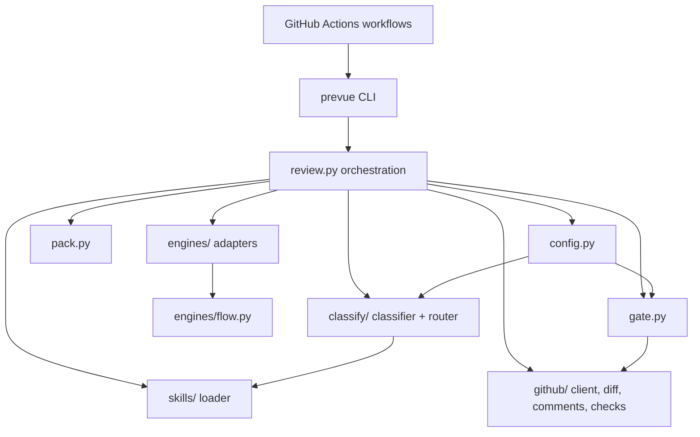

<!-- generated-by: gsd-doc-writer -->

# Architecture

## System overview

Prevue is a token-efficient AI pull-request review framework delivered as a GitHub Actions reusable workflow. On each eligible `pull_request` event, it fetches the PR diff via the GitHub REST API (no PR-head checkout), classifies changed files with deterministic glob rules (with an optional LLM fallback), loads only the review skills that match the change, packs files into a token budget, invokes a pluggable AI engine adapter, and posts results back to the PR as a sticky summary comment, inline review comments, and a pass/fail check run.

The architecture is a layered pipeline: **workflow shell → CLI → orchestration → classify/skills/pack → engine adapter → gate → GitHub publisher**. Python owns all review logic; the workflow only sets up the runner, checks out trusted refs, installs dependencies and the engine CLI, and invokes `uv run prevue review`.

## Component diagram



ASCII equivalent:

```
.github/workflows/  →  prevue CLI  →  review.py
                                        ├─ config.py (prevue.yml)
                                        ├─ github/ (fetch diff, post comments/checks)
                                        ├─ classify/ (labels → bundles)
                                        ├─ skills/ (load + assemble instructions)
                                        ├─ pack.py (token budget)
                                        ├─ engines/ (Copilot, Claude, Cursor, …)
                                        └─ gate.py (thresholds, placement)
```

## Data flow

A typical same-repo PR review follows this path:

1. **Trigger** — `pull_request` (`opened`, `synchronize`, `reopened`, `ready_for_review`) fires `.github/workflows/review.yml`, which waits for CI, then calls the reusable workflow `.github/workflows/prevue-review.yml`.
2. **Checkout** — The reusable workflow checks out the Prevue framework at `.prevue/` and the consumer repo at the **base ref** (`consumer/`). Consumer config and skills load from the trusted base ref, not the PR head (SKIL-04).
3. **Preflight** — `prevue preflight` compares `PR_HEAD_SHA` to the last-reviewed SHA in the sticky comment marker. Same-SHA re-runs skip engine CLI install.
4. **Context load** — `prevue review` reads PR context from `GITHUB_EVENT_PATH`, authenticates with `GITHUB_TOKEN`, and rejects fork PRs (`head.repo != base.repo`).
5. **Config + skip** — `load_config()` reads `.github/prevue.yml` (rules, review thresholds, skills caps, engine name, skip policy). `should_skip()` may exit early (labels, title patterns, bot authors).
6. **Scope decision** — `decide_scope()` chooses full, incremental, or noop based on the sticky marker SHA and `review.incremental`. Incremental runs fetch only files changed since the last review.
7. **Diff fetch + filter** — `fetch_diff()` or `fetch_diff_in_scope()` returns a `DiffBundle`. `filter_diff()` drops ignored paths per consumer `ignore_globs`.
8. **Skills + packing** — Built-in and consumer skills load from `prevue/skills/` and `.github/prevue/skills/`. `pack_files()` ranks files by classification risk and skill coverage, fitting the diff into `review.max_input_tokens` minus output reserve and instruction overhead.
9. **Classification** — `classify()` applies gitignore-style glob rules (`pathspec`) per file. Unmatched paths optionally go through `llm_classify()` via the selected engine. `route()` maps labels to skill bundle IDs.
10. **Engine review** — `ReviewRequest` (diff + assembled instructions + known issues) is passed to the selected `EngineAdapter.review()`. Adapters shell out to vendor CLIs; `flow.review_with_retry()` handles parse failures with one retry then degrades gracefully.
11. **Lifecycle merge** — Prior findings from sticky/inline threads merge into an open set (`_open_set_findings`). Outdated threads may resolve via GraphQL. Dismissals suppress fingerprints in changed regions.
12. **Gate** — `apply_gate()` applies severity thresholds, inline placement limits, and conclusion ladder (`success` / `neutral` / `failure`).
13. **Publish** — `post_inline_review()` batches inline comments; `upsert_sticky()` updates the marker comment; `conclude_review_check()` writes the `prevue/review` check run.

Command-driven reviews (`/prevue review`, `/prevue dismiss`, `/prevue resolve`) follow a parallel path through `commands.py`, reusing `run_review()` and GraphQL thread resolution.

## Key abstractions

| Abstraction | Location | Role |
|-------------|----------|------|
| `EngineAdapter` | `src/prevue/engines/base.py` | Pluggable port: `review(ReviewRequest) → ReviewResult`; optional `classify()` for LLM fallback |
| `ReviewRequest` / `ReviewResult` / `Finding` | `src/prevue/models.py` | Typed engine I/O contract; findings carry path, line, side, severity, title, body |
| `DiffBundle` / `ChangedFile` | `src/prevue/models.py` | Normalized PR diff; deliberately excludes PR title/body from engine input |
| `PrevueConfig` | `src/prevue/config.py` | Single-read consumer config bundle (ruleset, review, skip, fallback, skills, engine) |
| `RuleSet` / `ClassificationResult` | `src/prevue/classify/models.py` | Label rules, routing map, ignore globs, classification output |
| `Skill` | `src/prevue/skills/models.py` | Agent Skills-format guideline with bundle, `applies_to` globs, and markdown body |
| `GateResult` / `ReviewConfig` | `src/prevue/gate.py` | Severity thresholds, inline caps, check conclusion, placed vs summary-only findings |
| `PrContext` | `src/prevue/github/client.py` | Repo/PR identity from Actions event payload; no git checkout |
| `Engine registry` | `src/prevue/engines/registry.py` | Name → adapter class map; `require_functional_adapter()` excludes skeleton engines |

**Engine adapters** (registered in `registry.py`):

- `copilot-cli` — GitHub Copilot CLI (default, functional)
- `claude-code-cli` — Anthropic Claude Code CLI (functional)
- `cursor-cli` — Cursor CLI (functional)
- `gemini-cli` — skeleton only (`SKELETON_ENGINES`)

## Directory structure rationale

```
prevue/
├── .github/
│   ├── workflows/          # Delivery: review.yml (dogfood), prevue-review.yml (reusable workflow_call)
│   └── scripts/            # install-engine-cli.sh — engine-specific CLI setup
├── src/prevue/
│   ├── cli.py                # Entry point: review, command, preflight, gate-revalidate
│   ├── review.py             # End-to-end orchestration pipeline
│   ├── config.py             # Consumer prevue.yml loader
│   ├── gate.py               # Pass/fail policy and inline placement
│   ├── pack.py               # Token-budget file packing
│   ├── models.py             # Shared pydantic models (engine contract)
│   ├── classify/             # Deterministic classifier, router, LLM fallback, default rules
│   ├── skills/               # Built-in SKILL.md bundles + loader/select/assemble
│   ├── engines/              # Adapter implementations, prompt builder, parsing, retry flow
│   └── github/               # REST + GraphQL: diff, comments, checks, positions
├── tests/                    # pytest unit tests with responses fixtures
├── docs/                     # Consumer and contributor documentation
└── scripts/                  # Local CI helper (ci-local.sh)
```

**Why this layout:**

- **`src/prevue/`** — All framework logic in one installable Python package (`pyproject.toml` → `prevue` CLI). Keeps the reusable workflow thin and auditable.
- **`classify/` vs `skills/`** — Classification decides *what kind of change* this is; skills provide *how to review* that kind. Routing connects the two via `routing_map` in `prevue.yml`.
- **`engines/`** — Vendor-neutral adapter boundary. New engines add a class + registry entry without touching orchestration.
- **`github/`** — Isolates PyGithub/GraphQL concerns (diff fetch, sticky upsert, inline positions, check runs) from review policy.
- **`.github/workflows/prevue-review.yml`** — `workflow_call` interface for consumers: explicit `permissions`, named secret pass-through, dual checkout (framework + consumer base ref).
- **`prevue/skills/` (packaged)** — Built-in review guidelines ship inside the wheel via `importlib.resources`; consumers extend at `.github/prevue/skills/` on the base ref.

## Related documentation

- [configuration.md](./configuration.md) — `prevue.yml` settings and token budgets
- [skills.md](./skills.md) — Skill format and consumer overrides
- [consumer-setup.md](./consumer-setup.md) — Wiring the reusable workflow in a consumer repo
- [security.md](./security.md) — Fork guard, token scopes, base-ref trust model
